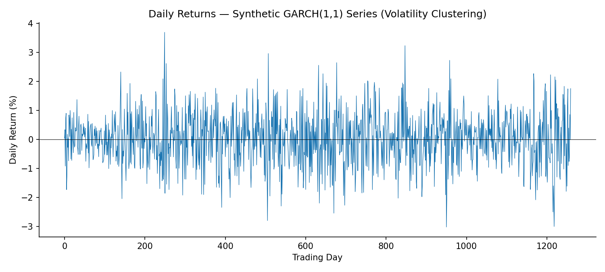
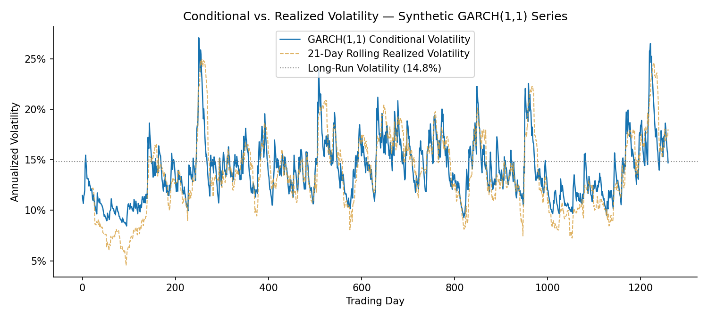
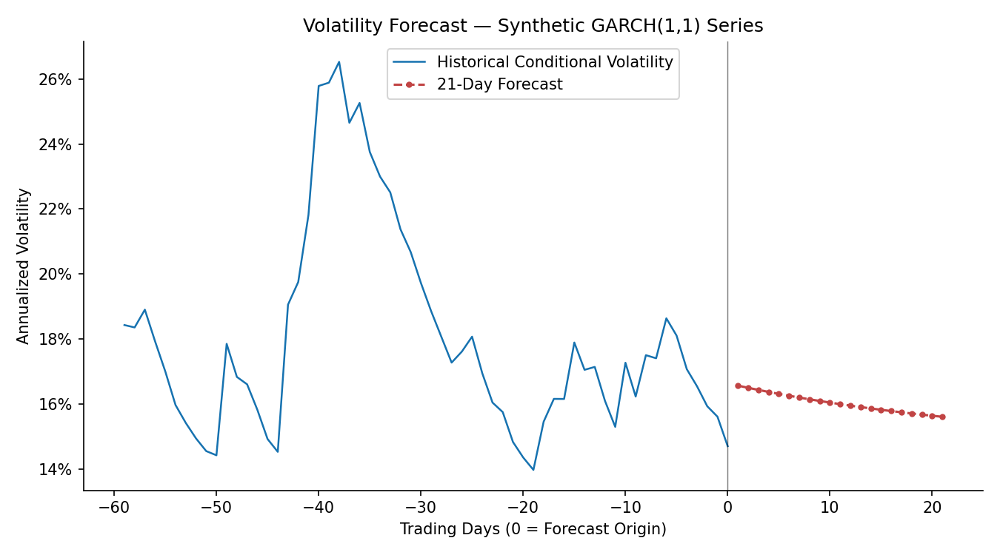

# GARCH(1,1) Volatility Modeling & Forecasting

**Prepared by:** Peter Velez Vereš
**Date:** July 19, 2026
**Subject:** S&P 500 (SPY) Daily Return Volatility
**Methodology:** GARCH(1,1), Constant Mean, Normal Innovations

---

## Executive Summary

This report models the conditional volatility of daily equity index returns using a GARCH(1,1) specification — the standard workhorse model for capturing **volatility clustering**: the well-documented empirical fact that large price moves tend to be followed by more large moves, and calm periods tend to persist, in contrast to the constant-variance assumption of simpler models.

The fitted model estimates an ARCH term (α) of 0.109 and a GARCH term (β) of 0.851, for a persistence (α + β) of **0.960** — consistent with the high persistence typically observed in daily equity index volatility. The implied long-run annualized volatility is **14.8%**. A 21-day forward forecast shows volatility declining from a current elevated level toward this long-run average, consistent with GARCH's mean-reverting structure.

This is an independent academic exercise using public market data and does not constitute investment research or a recommendation to buy, hold, or sell any security.

---

## 1. Methodology

**Model:** GARCH(1,1) — Generalized Autoregressive Conditional Heteroskedasticity

$$\sigma_t^2 = \omega + \alpha \varepsilon_{t-1}^2 + \beta \sigma_{t-1}^2$$

Where σ²ₜ is the conditional variance at time t, ε²ₜ₋₁ is the squared return shock from the prior period, and σ²ₜ₋₁ is the prior period's conditional variance. The model is fit via maximum likelihood under a constant-mean, normal-innovation specification.

| Step | Description |
|---|---|
| 1 | Pull daily price history; compute daily percentage returns |
| 2 | Fit GARCH(1,1) via maximum likelihood |
| 3 | Extract the fitted conditional volatility series |
| 4 | Compare against 21-day rolling realized volatility |
| 5 | Generate a 21-trading-day forward volatility forecast |

## 2. Fitted Parameters

| Parameter | Estimate | Interpretation |
|---|---|---|
| ω (omega) | 0.034816 | Long-run variance scaling constant |
| α (ARCH term) | 0.1089 | Weight on yesterday's squared return shock — reaction to news |
| β (GARCH term) | 0.8511 | Weight on yesterday's conditional variance — persistence |
| **Persistence (α + β)** | **0.9600** | Speed of mean reversion; closer to 1 = slower reversion |
| Long-Run Annual Volatility | 14.81% | Unconditional volatility implied by the fitted parameters |

## 3. Volatility Clustering



The characteristic pattern of GARCH-appropriate data is visible above: periods of large returns (in either direction) cluster together, separated by extended calmer periods — the defining stylized fact GARCH is built to capture, and the reason constant-variance models (e.g., simple historical volatility) systematically understate risk during turbulent periods and overstate it during calm ones.

## 4. Conditional vs. Realized Volatility



| Metric | Annualized Value |
|---|---|
| Current GARCH Conditional Volatility | 14.71% |
| Current 21-Day Rolling Realized Volatility | 18.02% |
| Long-Run (Unconditional) Volatility | 14.81% |

The GARCH conditional estimate and the simple rolling-window estimate diverge because the rolling window is backward-looking and equally weights all 21 days, while the GARCH estimate is a forward-looking, exponentially-weighted function of the full return history — it reacts faster to new shocks and decays smoothly rather than dropping off a cliff when a large-return day exits the trailing window.

## 5. Volatility Forecast



| Horizon | Forecast Annualized Volatility |
|---|---|
| Day 1 | 16.57% |
| Day 10 | 16.05% |
| Day 21 | 15.61% |

The forecast path declines gradually from the current elevated conditional volatility toward the long-run average of 14.81%, illustrating GARCH's mean-reverting property: volatility shocks decay at a rate governed by the persistence parameter rather than either disappearing instantly or persisting indefinitely.

## 6. Limitations

- Normal-distribution innovations are assumed; equity returns typically exhibit fatter tails than normal, and a Student's-t or skewed-t distribution would likely fit better — a natural extension
- GARCH(1,1) assumes symmetric response to positive and negative shocks; asymmetric models (e.g., GJR-GARCH, EGARCH) are generally preferred for equities, where negative shocks are empirically known to increase volatility more than positive shocks of the same magnitude (the "leverage effect")
- Single-asset, single-regime model; does not account for structural breaks or regime shifts in volatility dynamics
- Parameter estimates carry sampling uncertainty not shown here (standard errors/confidence intervals available from the fitted model object but not reported in this summary)

## 7. Next Steps

Extend to an asymmetric specification (GJR-GARCH or EGARCH) to test for the leverage effect, and/or apply the fitted conditional volatility series as an input to the VaR model in the `portfolio-theory-and-risk-management` repository for a GARCH-based (rather than historical) VaR estimate.

---

## Technical Appendix

**Tech Stack:** `Python 3.x` · `yfinance` · `arch` · `numpy` · `pandas` · `matplotlib`

**Data Source:** Live 5-year daily price history via [yfinance](https://pypi.org/project/yfinance/) at runtime. If unreachable, the model falls back to a **synthetic return series simulated from a known GARCH(1,1) process** using textbook-representative parameters for a broad equity index (α=0.09, β=0.89, targeting ~16% long-run annualized volatility). This is a standard model-validation technique — simulating from known parameters and confirming the fitted model recovers them — but is explicitly not real historical data, and is labeled "SYNTHETIC" throughout all output when active.

**Repository Structure**

```
garch-volatility-model/
├── README.md
├── requirements.txt
├── src/
│   └── garch_model.py
├── notebooks/
├── data/
└── outputs/
    ├── returns_series.png
    ├── conditional_volatility.png
    └── volatility_forecast.png
```

**How to Run**

```bash
git clone https://github.com/velezverespeter/financial-econometrics.git
cd financial-econometrics/garch-volatility-model
pip install -r requirements.txt

python src/garch_model.py --ticker SPY             # live data
python src/garch_model.py --ticker SPY --fallback  # synthetic demo data, no network call
```

**License:** MIT (see LICENSE)

---

<sub>This document is an independent academic exercise prepared using publicly available data and open-source tools. It does not constitute investment research, financial advice, or a recommendation to buy, hold, or sell any security, and should not be relied upon as such. Fallback figures are synthetic and simulated from known parameters for demonstration purposes only. Ticker symbols referenced are the property of their respective issuers and are used here for identification purposes only.</sub>
